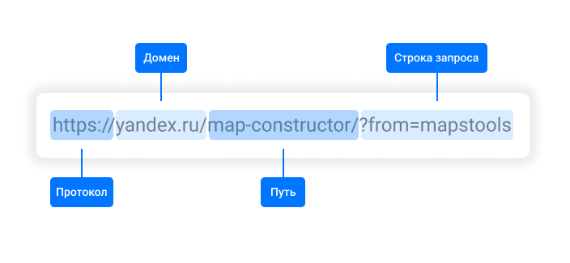
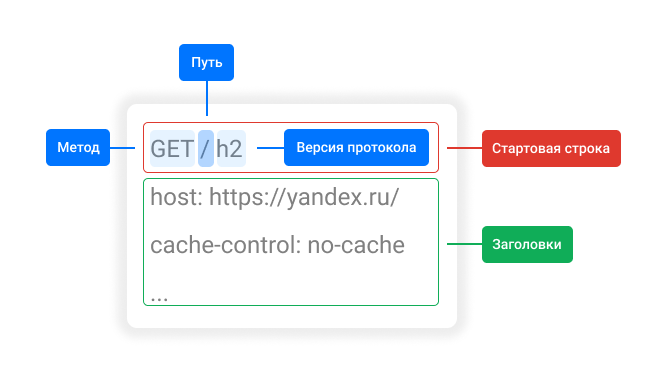

# Тестовое задание. HTTP протокол

## Что такое HTTP-протокол?

**HTTP** (Hyper Text Transfer Protocol) — базовый сетевой протокол, который обеспечивает доступ к различным ресурсам в Интернете, например html-документам. 

Клиенты и серверы взаимодействуют между собой обмениваясь индивидуальными сообщениями. Есть два вида таких сообщений:

- HTTP-запрос (request)
- HTTP-ответ (response)

### Структура HTTP-сообщения

1.	Стартовая строка (определяет тип сообщения)
2.	HTTP заголовки
3.	Тело сообщения (опционально)

## Что такое HTTP-запрос?

**HTTP-запрос** (request) – сообщение, которое отправляется клиентом на сервер, чтобы вызвать его реакцию в виде ответа. Каждый запрос, выполненный через Интернет, несет в себе серию закодированных данных, которые содержат различные типы информации. 

Стартовая строка HTTP-запроса содержит 3 элемента:

- HTTP-метод
- URL
- Версия HTTP

### Что такое HTTP-метод?

**HTTP-метод**, также называемый HTTP глаголом, указывает на действие, которое HTTP-запрос ожидает от запрашиваемого сервера. Наиболее распространенные виды HTTP-методов:

- **GET.** Запрашивает представление указанного ресурса. Запросы с использованием этого метода могут только извлекать данные
- **HEAD.** Запрашивает ресурс так же, как и метод GET, но без тела ответа.
- **POST.** Используется для отправки сущностей к определённому ресурсу. Часто вызывает изменение состояния или какие-то побочные эффекты на сервере
- **PUT.** Заменяет все текущие представления ресурса данными запроса
- **DELETE.** Удаляет указанный ресурс

### Что такое URL?

**URL** (Uniform Resource Locator) – абсолютный путь, порт и домен, на котором расположен ресурс. 



###  Для чего указывается версия HTTP?

Версия HTTP определяет то, какую структуру имеет оставшаяся часть сообщения (заголовки и тело сообщения), а также указывает какую версию предполагается использовать для ответа. Версии HTTP:

- **HTTP/0.9**. Простейшая реализация протокола, позволяющая только получать WEB – страницы
- **HTTP/1.0**. Версия включает в себя HTTP заголовки.
- **HTTP/1.1**. Улучшенная версия протокола 1.0, поддерживающая методы постоянных TCP-сессий, а также позволяющая отправку нескольких HTTP-запросов одновременно
- **HTTP/2**. В отличие от предыдущих версий, протокол является бинарным, эффективнее использует сетевые ресурсы и имеет более высокие показатели производительности.

### Что такое заголовки HTTP-запроса?

Заголовки HTTP-запроса используются для точного описания загружаемого ресурса или поведения сервера или клиента. Заголовки являются частью каждого HTTP-запроса и содержат текстовую информацию, которая хранится в парах вида: ключ-значение. Заголовки HTTP-запроса подразделяются на:

- **Основные заголовки** (General headers). Относятся к сообщению в целом
- **Заголовки запроса** (Request headers). Уточняют запрос или накладывают ограничения на условия.
- **Заголовки сущности** (Entity headers). Относятся к телу сообщения, такие заголовки отсутствуют, если нет тела.

### Тело HTTP-запроса

Является последним и необязательным элементом HTTP-запроса. Так, для методов вида GET, HEAD, DELETE, или OPTIONS тело запроса не требуется, однако используется, когда необходимо отправить данные на сервер (например, для обновления методом POST). 

### Пример HTTP-запроса



## Что такое HTTP-ответ?

**HTTP-ответ** (response) – информация, которую получает клиент в ответ на HTTP-запрос. Стартовая строка HTTP-ответа также содержит 3 элемента:

- Версия HTTP
- Код состояния HTTP
- Пояснение состояния (короткое пояснение кода состояния, например, для ошибки 404: “Not Found”)

### Что такое код состояния HTTP?

Код состояния HTTP представляет собой трехзначный код, который чаще всего используется для того, чтобы определить успешно ли выполнен запрос или нет. Набор кодов состояния является стандартом, кроме того, их можно разделить на 5 логических групп:

1.	**100–199**. Информационные коды — запрос получен, продолжается обработка.
2.	**200–299**. Успешные коды — запрос был успешно получен, понят и выполнен.
3.	**300–399**. Коды перенаправления — для выполнения запроса должны быть предприняты дальнейшие действия агента пользователя (программы, принимающей ответ на запрос).
4.	**400–499**. Коды ошибок клиента — запрос имеет некорректный синтаксис или не может быть выполнен. Также указывает, является ли ситуация временной или постоянной.
5.	**500–599**. Коды ошибок сервера — сервер не в состоянии выполнить допустимый запрос или выполнил его с ошибкой.

### Состав заголовков HTTP-ответа

Заголовки HTTP-ответа похожи по своей структуре на заголовки для запросов, имеют такой же формат записи (пара ключ-значение) и также состоят из одной строки. Поскольку существует большое количество заголовков HTTP-ответа их разделяют на 3 группы:

- ```Основные заголовки``` (General headers). Относятся к сообщению в целом.
- ```Заголовки ответа``` (Response headers). Содержат дополнительные сведения о сервере.
- ```Заголовки сущности``` (Entity headers). Относятся к телу сообщения, такие заголовки отсутствуют, если нет тела.

### Тело HTTP-ответа

Также, как и в запросе, тело является последним и необязательным элементом. Включение тела зависит не только от используемого метода, но и от кода состояний. Например, ответы, которые содержат коды состояния ```1ХХ```, ```204```, ```304``` не должны содержать тела сообщения, все другие ответы обычно содержат тело сообщения.

## HTTPS и его отличия от HTTP

```HTTPS``` (HTTP Secure) – это защищенная версия протокола HTTP, которая использует технологии SSL или TLS для шифрования всех соединений между клиентом и сервером. Такое защищённое соединение позволяет клиентам безопасно обмениваться конфиденциальными данными с сервером, например, для банковских операций или онлайн-покупок. 
